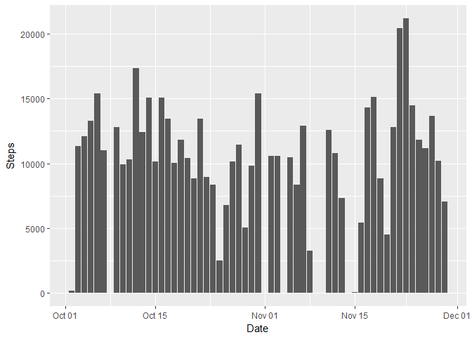
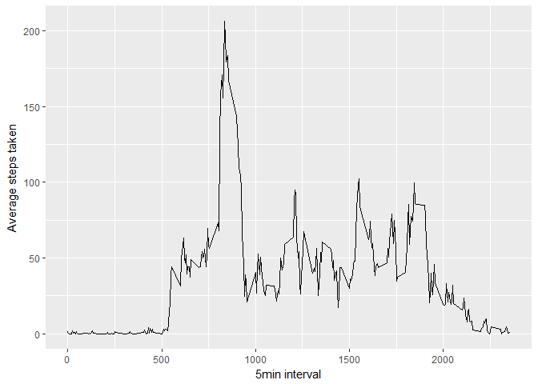
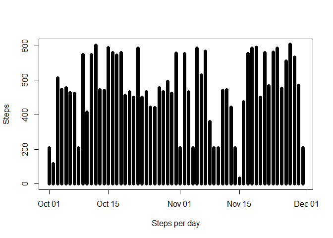
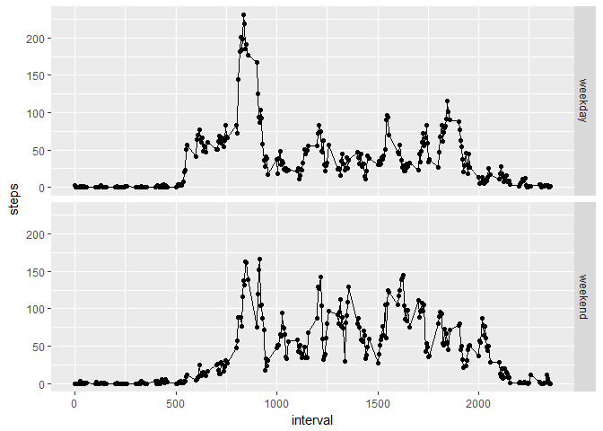

# Assignment1


Loading and preprocessing the data


```
## 
## Attaching package: 'dplyr'
```

```
## The following objects are masked from 'package:stats':
## 
##     filter, lag
```

```
## The following objects are masked from 'package:base':
## 
##     intersect, setdiff, setequal, union
```

```
## Warning: package 'lubridate' was built under R version 3.4.1
```

```
## 
## Attaching package: 'lubridate'
```

```
## The following object is masked from 'package:base':
## 
##     date
```


```r
mainSet <- read.csv("activity.csv")
mainSet$date <- ymd(mainSet$date)
stepDay <- aggregate(steps ~ date, mainSet, sum)
ggplot(stepDay,aes(x=stepDay$date,y=stepDay$steps)) + geom_bar(stat="identity") + labs(x="Date", y="Steps")
```

<!-- -->

What is mean total number of steps taken per day?


```r
avgs <- aggregate(x=list(steps=mainSet$steps), by=list(interval=mainSet$interval),  FUN=mean, na.rm=TRUE)
ggplot(data=avgs, aes(x=interval, y=steps)) + geom_line() + xlab("5min interval") +ylab("Average steps taken")
```

<!-- -->

```r
avgs[which.max(avgs$steps),]
```

```
##     interval    steps
## 104      835 206.1698
```

Imputing missing values


```r
#The presence of missing days may introduce bias into some calculations or summaries of the data. The total number of missing values in the dataset
table(is.na(mainSet$steps))
```

```
## 
## FALSE  TRUE 
## 15264  2304
```

```r
#Replacing missing values with means for the corresponding 5 min interval
valueFill <- function(steps, interval) {
    fill <- NA
    if (!is.na(steps))
        fill <- c(steps)
    else
        fill <- (avgs[avgs$interval==interval, "steps"])
    return(fill)
}
dataFill <- mainSet
dataFill$steps <- mapply(valueFill, dataFill$steps, dataFill$interval)
```

What is the average daily activity pattern?


```r
#making a Histogram for number of steps each day and the mean and median for steps
steps <- tapply(dataFill$steps, dataFill$date, FUN=sum)
plot(dataFill$steps~dataFill$date, type="h",xlab="Steps per day",lwd=7,ylab="Steps")
```

<!-- -->

```r
mean(steps)
```

```
## [1] 10766.19
```

```r
median(steps)
```

```
## [1] 10766.19
```

Are there differences in activity patterns between weekdays and weekends?

```r
#Create weekdays vector, adding a column to confirm whether it is a weekend or not
weekends <- which(weekdays(as.Date(dataFill$date)) == "Saturday" | weekdays(as.Date(dataFill$date)) == "Sunday")
weekdays <- which(weekdays(as.Date(dataFill$date)) != "Saturday" & weekdays(as.Date(dataFill$date)) != "Sunday")
tmp <- c(rep("XXX", length(dataFill)))
tmp[weekends] <- "weekend"
tmp[weekdays] <- "weekday"
names(tmp) <- "dayOfWeek"
dataFill <- cbind(dataFill, tmp)
names(dataFill)[4] <- "dayOfWeek"

resultsPerDay <- summarise(group_by(dataFill, dayOfWeek, interval), steps=mean(steps, na.rm=TRUE))
qplot(interval, steps, data=resultsPerDay, facets= dayOfWeek ~ .) + geom_line()
```

<!-- -->

